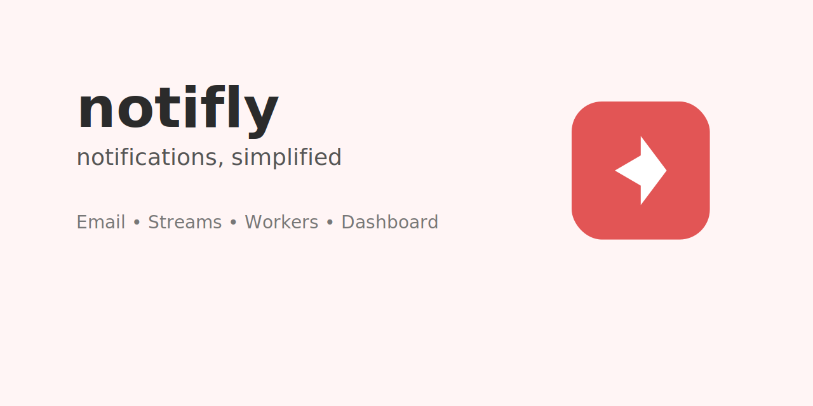
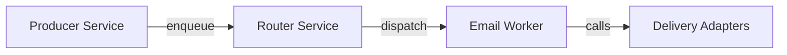

# NotiFly



NotiFly is a lightweight, modular notification platform designed for building, routing, and delivering notifications across multiple channels (email, SMS, push). This repository contains microservices, delivery adapters, and a Next.js admin UI to compose campaigns, route messages to providers, and process deliveries.

--

## Quick Overview

- **Purpose:** Provide a pluggable notification delivery system for campaigns and transactional messages.
- **Key components:** Producer, Router, Worker(s), Delivery adapters, Admin UI.
- **Primary languages / frameworks:** TypeScript, Node.js, Next.js.

--

## Architecture

The repository is organized as a small microservice ecosystem:

- `services/producer-service` — API for creating notifications/campaigns (ingest).
- `services/router-service` — Routes messages to appropriate delivery queues/providers.
- `services/worker-email` — Worker that processes email deliveries.
- `libs/delivery-adapters` — Pluggable adapters for SendGrid, AWS SES, Twilio, FCM, and mocks.
- `web` — Next.js admin UI for campaigns, dashboard, DLQ inspection, and auth.

Simple ASCII diagram:

    	+-----------+      +-----------+      +-----------+
    	|  Producer | ---> |  Router   | ---> |  Worker(s) |
    	+-----------+      +-----------+      +-----------+
                  |                  |                  |
                  v                  v                  v
               Postgres            Redis         Delivery Adapters
              (metadata)       (queues/state)   (SendGrid/SES/Twilio/FCM)

Mermaid flow (GitHub supports mermaid diagrams if enabled):



--

## Design & Principles

- **Separation of concerns:** Ingest, routing, and delivery are separated into different services for scalability.
- **Pluggable adapters:** Delivery providers are implemented behind adapter interfaces so providers can be swapped or mocked for tests.
- **Resilience:** Redis-backed queues and DLQ (dead-letter queues) allow retries and inspection of failed deliveries.
- **Observable:** Dashboard in the admin UI surfaces delivery stats; services should emit metrics and logs.

--

## Service responsibilities & APIs

Note: these are descriptive; check each service's `src` folder for exact routes and request/response shapes.

- Producer Service (`services/producer-service`)
  - Purpose: accept notification/campaign creation requests, persist to Postgres, and enqueue routing jobs.
  - Example endpoints:
    - `POST /notifications` — create a notification
    - `GET /campaigns/:id` — fetch campaign details

- Router Service (`services/router-service`)
  - Purpose: consumes messages, decides provider/channel, and forwards to worker queues.
  - Example behavior: read notification, enrich with provider selection, publish to worker queue.

- Worker (e.g., `services/worker-email`)
  - Purpose: pick messages from queue, call delivery adapters (SendGrid/SES), handle retries and DLQ.

Adapter contract (conceptual)

- `send(payload)` — deliver the message, return delivery status or error.

--

## Local setup (Development)

Prerequisites:

- Node 18+ and npm/yarn
- Docker & Docker Compose (for Postgres, Redis, Mongo)

Start infra (Redis, Postgres, Mongo):

```bash
docker-compose up -d
```

Install root dev tools (optional for formatting):

```bash
npm install
```

Start individual services (example):

```bash
# Producer service
cd services/producer-service
npm install
npm run dev

# Router service
cd ../router-service
npm install
npm run dev

# Email worker
cd ../worker-email
npm install
npm run dev

# Admin UI
cd ../../web
npm install
npm run dev
```

Notes:

- Environment variables are loaded from each service's config folder; check `src/config/env.ts` or README in the service folder for required env vars (DB, Redis, provider keys).

--

## Formatting & linting

Run the provided repo formatter (Prettier):

```bash
./format.sh
# or one-off
npx prettier --write "**/*.{js,ts,tsx,jsx,json,md,css,scss,html,yml,yaml,sql,mdx}"
```

--

## Testing

Each service includes tests in its `tests/` folder. Run tests inside each service folder, for example:

```bash
cd services/producer-service
npm test
```

--

## Recent changes (2026-01-31)

- Added a SQL migration: `infra/sql/001-add-channel-to-deliveries.sql` — run this migration against Postgres to add channel support in the `deliveries` table.
- Services are TypeScript-based and produce `dist/` builds; run `npm run build` before `npm run start` in production environments.
- `services/router-service` and `services/worker-email` have been updated to better separate routing and delivery responsibilities; refer to each service README for env vars and run commands.
- Delivery adapters (under `libs/delivery-adapters`) include improved mocks and provider adapters (SendGrid, SES, Twilio, FCM). Keep provider keys out of source control and use environment injection for production.
- Repo formatter: use `./format.sh` or `npm run format` at the repo root to keep styling consistent.

If you want, I can open PR-ready edits that also add per-service example `.env` files and a workspace `scripts` block to the top-level `package.json` to simplify starting all services locally.
